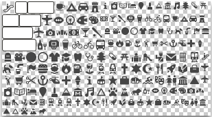

### Fill样式

> + 请特别关注`fill-pattern`这个属性，下面的`Sprite 样式库`会详细介绍
> + 请特别关注`"type":"line",`这个属性，这里要表达的是虽然`数据源是区`，但是仍然可以使用`线的样式`来绘制对应的区的边界线。`区可以复用线的样式`

---
#### 提交BUG
> 找到bug请提交,我们会及时解决[issue](https://github.com/ParnDeedlit/WebClient-Mapbox/issues)


#### Mapbox样式

[官方参考示例](https://www.mapbox.com/mapbox-gl-js/style-spec#layers-line)

> MapBox的样式只针对矢量数据有效，如geojson，矢量瓦片等。 栅格瓦片是不生效的。

MapBox对矢量数据的样式设置都是`基于图层级别`的，即下面的核心代码

``` json
//添加数据源，这里是geojson
map.addSource('lineLayer', {
  "type": "geojson",
  "data": geojsonData
});
//针对数据源设置图层样式
map.addLayer({
  "id": "huiyishi", //id不同重复，否则只绘制一次
  "type": "fill",
  "source": "fillLayer", //必须和上面的geojsonPolygon一致
  "filter": ["==", "name", "会议室"], //关键点：name对应geojson中的属性字段
  "layout": {
    "visibility": "visible",//visible/none  表示是否可见
  },
  "paint": {
    "fill-antialias": true, //抗锯齿，true表示针对边界缝隙进行填充
    "fill-color": "#00695c", //颜色
    "fill-opacity": 0.9, //透明度
    "fill-outline-color": "#FFFF00", //边线颜色，没错,确实没有边线宽度这个选项
    "fill-pattern":"picture_name", //线的拉伸图片类型，一定要与对应的样式库的图片名字一一对应
    "fill-translate": [0,0] //表示显示位置基于原始位置上,再按照屏幕坐标进行偏移,这个应该绝大部分都用不上
  }
});
map.addLayer({
  "id": "bounding",
  "type": "line",  //相信你的眼睛，这里的的确确是line，区可以复用线的样式
  "source": "fillLayer", //必须和上面的geojsonPolygon一致
  "filter": ["==", "name", "边界区"], //关键点：name对应geojson中的属性字段
  "paint": {
    "line-width": 4, //宽度
    "line-color": "#e51c23", //颜色
    "line-opacity": 1.0, //透明度
    "line-gap-width": 2, //线的沟宽，如果有一条线会变成2条线，中间有条沟
  }
});
```

上面的代码核心部分是4个部分

> + **source** `数据源的名称`必须和之前的map.addSource('sourceName')一致，`特别重要`
> + **filter** `过滤条件` 按照各自的业务实现对应的数据过滤，注意属性字段的一一匹配
> + **layout** `视图` 一般是控制是否可见、注记的避让压盖关系等，`类型type=symbol时`需要特别重视
> + **paint** `画笔样式` *这才是真正决定颜色、宽度、透明度等样式的地方*，不同的类型对应的属性也各自不同，需要注意这点

---
#### 参数

##### layout参数

|名称|类型|说明|
|:---|:---|:---|
|visibility|String字符串| visible, 是否可见  visible / none|

##### paint参数
|名称|类型|说明|
|:---|:---|:---|
|fill-antialias|Bool布尔型| true, 抗锯齿，true表示针对边界缝隙进行填充|
|fill-color|String字符串|颜色举例：`#ff0`，`#ffff00`,`rgb(255, 255, 0)`,`rgba(255, 255, 0, 1)`,`hsl(100, 50%, 50%)`,`hsla(100, 50%, 50%, 1)`,`yellow`|
|fill-opacity|Number数字型| 0.9, 透明度|
|fill-outline-color|String字符串| #FFFF00, 边线颜色，没错,确实`没有边线宽度`这个选项|
|fill-pattern|String字符串|picture_name, 区的拉伸图片类型，一定要与对应的样式库的图片名字一一对应|
|fill-translate|Number数组型| [0,0] 表示显示位置基于原始位置上,再按照屏幕坐标进行偏移,这个应该绝大部分都用不上|


---
#### Sprite 样式库

**基本导入**

``` javascript
var map = new mapboxgl.Map({
  style: {
    "version": 8,
    //特别注意，这里是用的mapbox官方的，中地内部的请参考中地glyphs
    "glyphs":   "mapbox://fonts/mapbox/{fontstack}/{range}.pbf",
    //特别注意，这里是用的mapbox官方的，中地内部的请参考中地sprite
    "sprite": "mapbox://sprites/mapbox/bright-v8"
  },
});
```




> Sprite 样式库将将所有的符号排列在一张图片上，然后更具每个字符`airport-15`的映射找到对应的符号在整个图片的起始位置和宽高

~~~ json
airport-15: {
  width: 17,   //宽为17
  height: 17,  //高为17
  x: 45,       //在大图中的水平位置是45
  y: 37,       //在大图中的竖直位置是37
  pixelRatio: 1,//像素角度，使效果先对圆润
  visible: true
}
~~~


[官方样式库地址](https://api.mapbox.com/styles/v1/mapbox/bright-v8/sprite.json?access_token=pk.eyJ1IjoicGFybmRlZWRsaXQiLCJhIjoiY2o1MjBtYTRuMDhpaTMzbXhpdjd3YzhjdCJ9.sCoubaHF9-nhGTA-sgz0sA)

~~~ json
{
    airport-15: {
      width: 17,
      height: 17,
      x: 45,
      y: 37,
      pixelRatio: 1,
      visible: true
    }
    alcohol-shop-11: {
      width: 13,
      height: 13,
      x: 204,
      y: 124,
      pixelRatio: 1,
      visible: true
    }
    alcohol-shop-15: {
      width: 17,
      height: 17,
      x: 50,
      y: 55,
      pixelRatio: 1,
      visible: true
    }
}
~~~

---
#### 样式库使用

``` javascript
map.addLayer({
  "id": "main",  //id不同重复，负责只绘制一次
  "type": "fill",
  "source": "fillLayer", //必须和上面的geojsonPolygon一致
  "paint": {
    "fill-pattern":"alcohol-shop-15", //区的拉伸图片类型，一定要与对应的样式库的图片名字一一对应
  }
});
```

---
#### 自己生成样式库
请参考[Sprite样式库](https://www.mapbox.com/mapbox-gl-js/style-spec#sprite)和[生成工具](https://github.com/mapbox/spritezero-cli)
